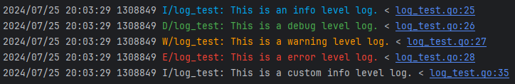

# Pretty Log

简单日志，在一定程度上使打印的日志简洁清晰。

## TODO

1. 水平表格增加标题居中 Flag；
2. 垂直表格增加序号隐藏；

## 使用

```shell
go get github.com/my-dev-lib/pretty-log-go
```

```go
import (
    prettylog "github.com/my-dev-lib/pretty-log-go"
)
```

## 输出不同级别日志

```go
prettylog.P("prettylog.print(...)\n")
prettylog.Pf("prettylog.printf %s\n", "(...)")
prettylog.Pln("prettylog.println(...)")

log := prettylog.NewLog("[Test]")
log.SetFlag(prettylog.FlagColorEnabled)
log.I("This is an info level log.")
log.D("This is a debug level log.")
log.W("This is a warn level log.")
log.E("This is an error level log.")
```

```shell
2024/01/14 19:19:29 prettylog.print(...)
2024/01/14 19:19:29 prettylog.printf (...)
2024/01/14 19:19:29 prettylog.println(...)
2024/01/14 19:19:29 [Test][INFO] This is an info level log.
2024/01/14 19:19:29 [Test][DEBUG] This is a debug level log.
2024/01/14 19:19:29 [Test][WARN] This is a warn level log.
2024/01/14 19:19:29 [Test][ERROR] This is an error level log.
```

开启颜色（不能保证所有终端都支持）。

```go
log.SetFlag(prettylog.FlagColorEnabled)
```



## 输出醒目的信息

```go
fmt.Println(prettylog.GetHighlightLine("欢迎进入 V1.0 系统", 30))

lines := []string{"欢迎进入 V1.0 系统", "运行中…"}
fmt.Println(prettylog.GetHighlightLines(lines, 25))
```

```shell
┏━━━━━━━━━━━━━━━━━━━━━━━━━━━━━
┃ 欢迎进入 V1.0 系统
┗━━━━━━━━━━━━━━━━━━━━━━━━━━━━━

┏━━━━━━━━━━━━━━━━━━━━━━━━
┃ 欢迎进入 V1.0 系统
┃ 运行中…
┗━━━━━━━━━━━━━━━━━━━━━━━━
```

## 输出表格

不支持中文，因为无法确保对齐。

```go
// 直接获得表格
content := [][]interface{}{
    {"Name", "Age", "City", "High"},
    {"Alice", 25, "Beijing", "170cm"},
    {"Bob", 30, "San Francisco", "180cm"},
}
fmt.Println(prettylog.GetPrettyTable(content))

// 带名称
fmt.Println(prettylog.GetPrettyTableWithName(content, "Members"))
```

```shell
┌──────────────────────────────────┐
│ Name   Age  City           High  │
│ ─────  ───  ─────────────  ───── │
│ Alice  25   Beijing        170cm │
│ Bob    30   San Francisco  180cm │
└──────────────────────────────────┘
┌──────────────────────────────────┐
│ Members                          │
├──────────────────────────────────┤
│ Name   Age  City           High  │
│ ─────  ───  ─────────────  ───── │
│ Alice  25   Beijing        170cm │
│ Bob    30   San Francisco  180cm │
└──────────────────────────────────┘
```

以创建对象的方式输出水平表格。

```go
// 逐行记录表格，统一获得
prettyTable := prettylog.NewPrettyTable()
prettyTable.SetTableName("Members")
prettyTable.SetTitles("Name", "Age", "City", "High")
prettyTable.AddValues("Alice", 25, "Beijing", "170cm")
prettyTable.AddValues("Bob", 30, "San Francisco", "180cm")
fmt.Println(prettyTable.Get())
```

```shell
┌──────────────────────────────────┐
│ Members                          │
├──────────────────────────────────┤
│ Name   Age  City           High  │
│ ─────  ───  ─────────────  ───── │
│ Alice  25   Beijing        170cm │
│ Bob    30   San Francisco  180cm │
└──────────────────────────────────┘
```

如果表格列过多，导致折行 ，可选择输出垂直表格。

```go
// 垂直表格
verticalTable := prettylog.NewVerticalPrettyTable()
verticalTable.SetTableName("Members")
verticalTable.SetTitles("Name", "Age", "City", "High")
verticalTable.AddValues("Alice", 25, "Beijing", "170cm")
verticalTable.AddValues("Bob", 30, "San Francisco", "180cm")
fmt.Println(verticalTable.Get())
```

```shell
┌────────────────────╼
│       Members       
├────────[ 0 ]───────┈
│ Name: Alice
│  Age: 25
│ City: Beijing
│ High: 170cm
├────────[ 1 ]───────┈
│ Name: Bob
│  Age: 30
│ City: San Francisco
│ High: 180cm
└────────────────────╼
```